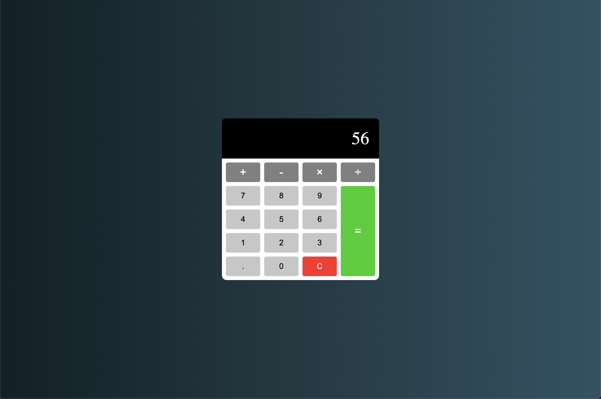

# Calculator

## URL

https://vasildimov98.github.io/17.calculator/

## Description

My Calculator is a compact and efficient calculator app built using JavaScript. It provides a convenient tool for performing basic arithmetic calculations quickly and accurately. Whether you need to add, subtract, multiply, or divide numbers, Calculator has got you covered.

Calculator is a valuable tool for anyone needing a reliable and efficient calculator. Whether you're a student, professional, or simply require a quick calculation on the go, this JavaScript-powered calculator app simplifies your mathematical tasks. Download Calculator today and experience the convenience of accurate calculations at your fingertips.

